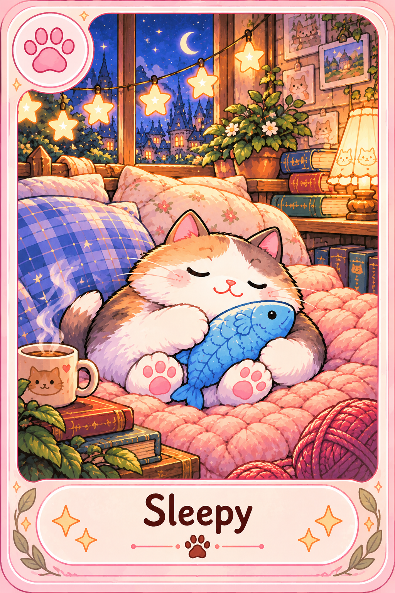

# Purrrfolio

Purrrfolio (КотоКоллекция) is a Telegram-first collectible card game about cozy kawaii cats. Players open fluffy packs, complete themed sets, and trade duplicates — all through bot commands, without a Mini App or in-game currency. Extra packs are bought with Telegram Stars.

The repository currently contains the project scaffold: Kotlin/Spring Boot backend, PostgreSQL schema, JSON card catalog, extracted starter card art, and implementation documentation derived from the concept images in `docs/source/`.



## Play (planned)

Open `@purrrfolio_bot` and use:

- `/start` — register and open the main menu
- `/collection` — inspect owned cards and duplicates (10 collections per page)
- `/pack` — open a fluffy pack (3 cards)
- `/buy` — buy packs with Telegram Stars (1/3/5/10 packs for 5/12/16/25 Stars)
- `/trade` — random trade of a duplicate from the shared pool
- `/market` — list duplicates, browse others, offer card-for-card trades
- `/language` — switch between English and Russian
- `/help` — command help
- `/paysupport` — Stars payment support

The bot is English by default; players whose Telegram language is Russian see Russian copy automatically. Use `/language` at any time to switch.

## Product Principles

- A normal session should fit into 1–3 minutes of Telegram chat.
- Depth comes from rarity, themed sets, duplicates, and social trading — not from a separate client UI.
- There is no in-game currency: 3 starter packs, then 1 free pack every 23 hours, extra packs via Telegram Stars.
- Card definitions, themes, pack prices, and rarity weights are data-driven JSON.
- The backend is the authority for inventory, packs, trades, and marketplace settlement.

## Stack

`Kotlin` `Spring Boot` `PostgreSQL` `Flyway` `Telegram Bot API` `Gradle`

## Documentation

- Implementation spec (command-only MVP): [docs/implementation-spec.md](docs/implementation-spec.md)
- Product overview: [docs/product-overview.md](docs/product-overview.md)
- Architecture: [DOCUMENTATION.md](DOCUMENTATION.md)
- Agent guide: [AGENTS.md](AGENTS.md)

## Local Development

### Requirements

- JDK 17+
- Docker (for PostgreSQL) or a local PostgreSQL instance
- Telegram bot token (from [@BotFather](https://t.me/BotFather))

### Quick start

```bash
docker compose up -d
cp src/main/resources/application-local.example.yml src/main/resources/application-local.yml
# edit application-local.yml with TELEGRAM_BOT_TOKEN and TELEGRAM_WEBHOOK_SECRET

./gradlew test
./gradlew bootRun --args='--spring.profiles.active=local'
```

Card art (`assets/cards/`, mirrored to `src/main/resources/static/assets/cards/`) is generated with an image model from the prompts in `docs/source/card-art-prompts.md` — one standalone 1024×1536 PNG per card, no sprite sheets or script rendering.

## Repository Layout

```text
src/main/kotlin/com/anry88/purrrfolio/
  catalog/     JSON-driven card and theme definitions
  collection/  themed set progress helpers
  pack/        weighted pack opening logic
  trade/       trade and marketplace policies
  telegram/    Telegram API client and update models
  game/        command routing and player-facing copy
  web/         health checks and bot webhook
assets/cards/  extracted card PNGs (source of truth for art pipeline)
docs/source/   original concept and sprite sheet images
```

## License

Apache License 2.0 — see [LICENSE](LICENSE).
