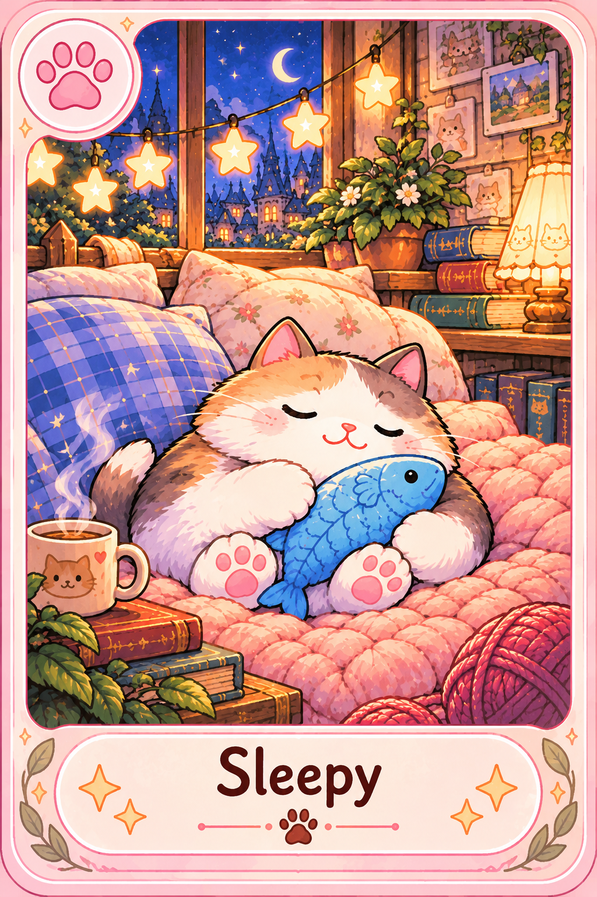

# Purrrfolio

Purrrfolio (КотоКоллекция) is a Telegram-first collectible card game about cozy kawaii cats. Players open fluffy packs, complete themed sets, and trade duplicates — all through bot commands, without a Mini App or in-game currency. Extra packs are bought with Telegram Stars.

The repository contains a working command-only bot backend: JDBC persistence,
pack and free-card claims, collection galleries, crafting, random trades, a
card-for-card marketplace, Telegram Stars purchases and refunds, group raffles,
Prometheus metrics, and a private TikTok API demo surface for marketing review.
The JSON catalog currently contains 305 cards across 17 collections.



## Gameplay

Open [`@PurrrfolioBot`](https://t.me/PurrrfolioBot) and use:

- `/start` — register and open the main menu
- `/collection` — inspect owned cards and duplicates (10 collections per page)
- `/pack` — open a fluffy pack (3 cards)
- `/freecard` — immediately claim a free single card when due (first immediately, then every 3 hours)
- `/craft` — melt duplicates into points (15 pts = 1 pack)
- `/buy` — buy packs with Telegram Stars (1/3/5/10 packs for 5/12/16/25 Stars)
- `/trade` — random trade of a duplicate from the shared pool
- `/market` — list duplicates, browse others, offer card-for-card trades (listings paginate 5 per page; unsold listings return to the owner after 7 days)
- `/language` — switch between English and Russian
- `/menu` — show action buttons under a message
- `/notifications` — enable reminders or pause them for 10 hours, 1 day, 3 days, or forever
- `/help` — command help
- `/paysupport` — select a Stars purchase and request an admin-approved refund

The bot ignores arbitrary text and unsupported commands. In private and group
chats it responds only to supported slash commands, controls, and documented
text aliases.

Common actions also work as plain chat words in both languages: `pack` / `набор`,
`craft` / `крафт`, `market` / `биржа`, and `card`, `cat`, `kitty`, `kitten` /
`карточка`, `котик`, `кот`, `котейка`, `кошка`, `котёнок` for the free card.
`/menu` provides inline action buttons. The persistent reply keyboard is kept in
private chats; group and supergroup replies remove it. Existing group keyboards
can be cleared with `/help`, without a separate service message.

Reminders are enabled by default and sent privately: unopened packs once daily
at 12:00 in the configured game timezone, and a free card once when it becomes
available. Pauses and delivery state survive restarts. A ready card waits until
a pause ends; old unclaimed free cards are included. Blocked or unreachable
recipients are excluded until they contact the bot privately or unblock it.
Reminder messages are paced; Telegram rate limits pause the broadcast until
sending is allowed again.

Special collections have their own drop conditions: Calendar Cats follow the
current month or season; Friends cards can drop only from pack or free-card
requests made in a Telegram group or supergroup. Special status does not alter
the configured rarity odds.

Halloween 2026 contains 20 special cards about festive activities, decorations,
and costumes. They can drop from packs and free-card claims from October 15
through November 15, 2026, inclusive, in the configured game timezone, in both
private and group chats. Collected cards remain available for galleries and
trading after the event. The 2026 window does not automatically repeat next year.

Completing a themed collection grants one free pack. The reward is tracked per
catalog version: if new cards are later added to that collection, completing
the expanded set grants another pack.

In eligible groups with at least 10 members, the bot can also run one automatic
pack raffle per 24 hours after a supported command. Registered players seen in
that group form the winner pool.

The bot is English by default; players whose Telegram language is Russian see Russian copy automatically. Use `/language` at any time to switch.

## Current Engineering Status

The gameplay above is implemented and backed by PostgreSQL. Player creation and
starter packs commit atomically. Pack balance validation, debit, card upserts,
and completion rewards also commit in one transaction while a per-player row
lock prevents double spending from concurrent taps. Pack results are recorded by
Telegram `update_id`, so a delivery retry restores the same cards without another
debit. PostgreSQL Testcontainers coverage exercises registration, concurrency,
persistence, and the photo-send flow.

New players receive a short welcome plus a prominent starter-pack button. Every
card reveal and collection gallery includes a share button that opens Telegram's
recipient chooser. The shared post contains the card photo and a named referral
link without exposing the image URL or a raw referral URL. A genuinely new player
joining through it receives 5 referral packs in addition to the normal 3 starter
packs, for 8 total. The referrer receives 5 packs for each of the first 10 such
registrations in a calendar month; later newcomers still receive all 8 packs.

## Product Principles

- A normal session should fit into 1–3 minutes of Telegram chat.
- Depth comes from rarity, themed sets, duplicates, and social trading — not from a separate client UI.
- Every completed collection grants 1 pack; an expanded collection can grant again after its new version is completed.
- There is no in-game currency: 3 starter packs of 3 cards, then 1 free single card every 3 hours, extra packs via Telegram Stars.
- Card definitions, themes, pack prices, and rarity weights are data-driven JSON.
- The backend is the authority for inventory, packs, trades, and marketplace settlement.

## Stack

`Kotlin` `Spring Boot` `PostgreSQL` `Flyway` `Telegram Bot API` `Gradle`

## Documentation

- Implementation spec (command-only MVP): [docs/implementation-spec.md](docs/implementation-spec.md)
- Product overview: [docs/product-overview.md](docs/product-overview.md)
- Architecture: [DOCUMENTATION.md](DOCUMENTATION.md)
- Agent guide: [AGENTS.md](AGENTS.md)

## Private Marketing Integrations

`/go/tiktok` is a private admin-only page for TikTok Developer review and future
API-based video posting automation. It is not part of the player game surface.
Configure `MARKETING_ADMIN_TOKEN`, `TIKTOK_CLIENT_KEY`, `TIKTOK_CLIENT_SECRET`,
and `TIKTOK_REDIRECT_URI` before using it.

## Local Development

### Requirements

- JDK 17+
- Docker (for PostgreSQL) or a local PostgreSQL instance
- Telegram bot token (from [@BotFather](https://t.me/BotFather))

### Quick start

```bash
docker compose up -d
cp src/main/resources/application-local.example.yml src/main/resources/application-local.yml
# edit application-local.yml with TELEGRAM_BOT_TOKEN, TELEGRAM_WEBHOOK_SECRET,
# PAYMENT_PAYLOAD_SECRET, and the private ADMIN_TG_ID used for payment-support decisions

./gradlew test
./gradlew bootRun --args='--spring.profiles.active=local'
```

Card art (`assets/cards/`, mirrored to `src/main/resources/static/assets/cards/`) is generated with an image model from the prompts in `docs/source/card-art-prompts.md` — one standalone 1024×1536 PNG per card, no sprite sheets or script rendering.

## Repository Layout

```text
src/main/kotlin/com/anry88/purrrfolio/
  catalog/     JSON-driven card and theme definitions
  collection/  themed set progress helpers
  craft/       duplicate-to-pack crafting policy
  i18n/        English/Russian player-facing copy
  pack/        weighted pack opening logic
  trade/       trade and marketplace policies
  repository/  JDBC repositories for players, inventory, economy, and trades
  telegram/    Telegram API client and update models
  game/        command routing and player-facing copy
  observability/ Micrometer metrics and database gauges
  web/         health checks and bot webhook
assets/cards/  generated card PNGs (source of truth for art pipeline)
docs/source/   original concept and sprite sheet images
```

## License

Apache License 2.0 — see [LICENSE](LICENSE).
