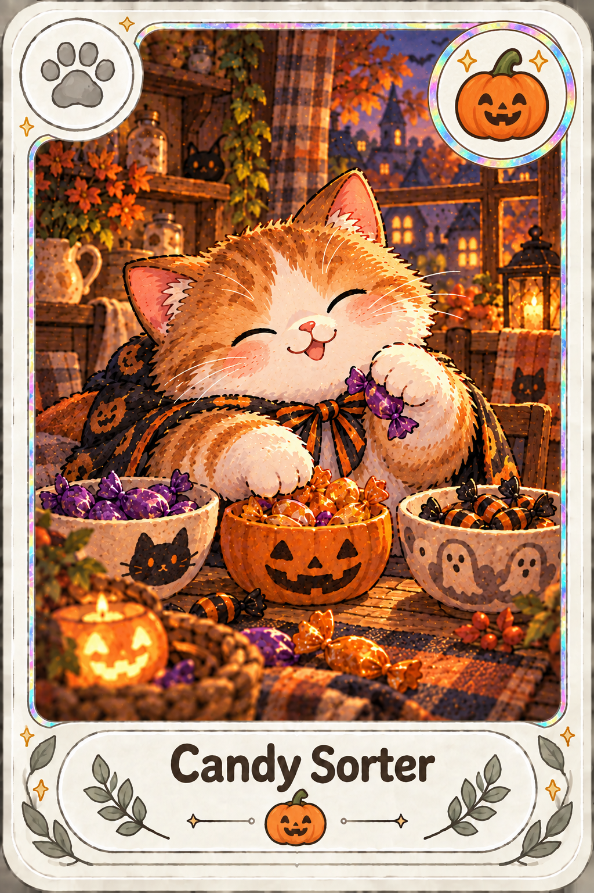
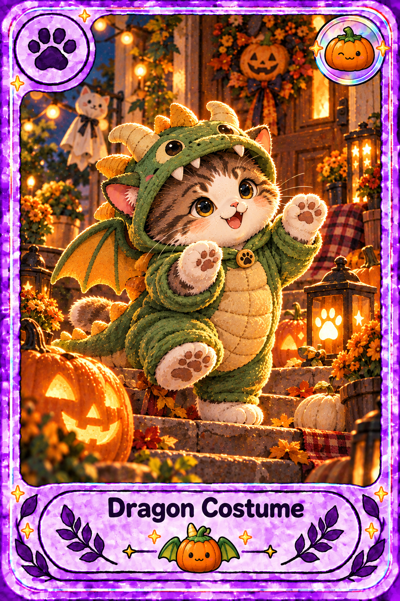
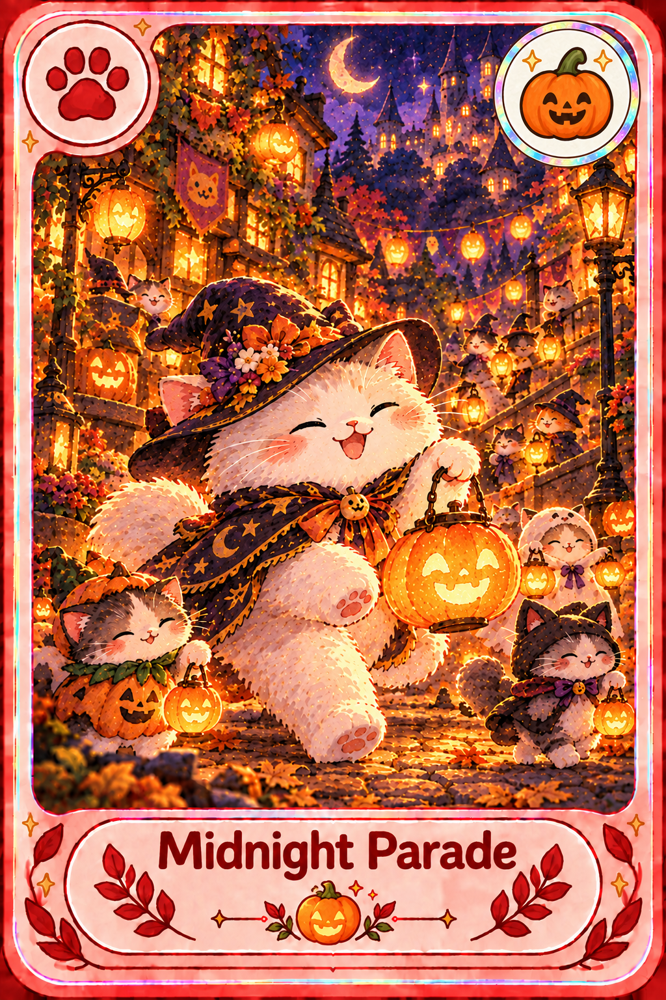

# Halloween 2026 — AND-14

20 special-карт: 7 праздничных занятий, 6 сцен декора, 7 костюмных сцен.
Окно нового дропа: 15.10.2026–15.11.2026 включительно, игровой часовой пояс.
В текущем production это UTC. Пул одинаково доступен через `/pack` и `/freecard`
в личных и групповых чатах; редкости сохраняют свои общие веса.
Собранные карты и повторная доставка квитанций доступны после окончания окна.
Следующий год автоматически не включается в окно сезона 2026.

Все 20 самостоятельных PNG 1024×1536 RGB созданы и исправлены через встроенный
imagegen. Общий дизайн special-маркера приведён к одному эталону
`assets/special-markers/halloween.png`: ivory-диск, радужный ободок, улыбающаяся
тыква с тремя зубами и две золотые звезды внутри круга. Скриптовые overlay
не применялись — владелец явно выбрал правки только моделью. Единая идентичность
знака проверена визуально; модельная перерисовка оставляет небольшие различия
масштаба/положения и не означает побайтовую идентичность всех знаков.
Каждая итоговая карта побайтово совпадает с native output и своей runtime-копией.
Всего 58 вызовов imagegen включают первичные изображения, отдельный эталон,
правки маркеров/масштаба и отклонённые варианты.
Точные первые промпты, references, SHA-256 арта и числа попыток сохранены в
[source/halloween-2026-plan.json](source/halloween-2026-plan.json).

Проверка кода включает все четыре даты 14/15 октября и 15/16 ноября,
оба типа чата, исключение другого года, совместное применение фильтров,
обработку неверного окна и восстановление ранее полученных карточек по
квитанции после окончания события. Финальный `./gradlew test bootJar` прошёл:
167 тестов, 0 ошибок, 0 пропусков. В итоговом JAR проверены каталог
393 карт / 21 коллекция, все 20 исправленных Halloween PNG, 88 PNG AND-12
и отдельный эталон маркера по SHA-256. Готовность repository не означает
подтверждение deploy; production-проверка фиксируется после запуска релиза.

## Карты

| Карта | Редкость | Категория | PNG |
| --- | --- | --- | --- |
| Candy Sorter / Сортировщик сладостей | COMMON | занятие | [halloween-candy-sorter.png](../assets/cards/halloween-candy-sorter.png) |
| Paper Bats / Бумажные летучие мыши | COMMON | декор | [halloween-paper-bats.png](../assets/cards/halloween-paper-bats.png) |
| Sheet Ghost / Привидение в простыне | COMMON | костюм | [halloween-sheet-ghost.png](../assets/cards/halloween-sheet-ghost.png) |
| Pumpkin Carver / Резчик тыкв | COMMON | занятие | [halloween-pumpkin-carver.png](../assets/cards/halloween-pumpkin-carver.png) |
| Costume Stitcher / Портной костюмов | COMMON | занятие | [halloween-costume-stitcher.png](../assets/cards/halloween-costume-stitcher.png) |
| Window Webs / Паутинки на окне | COMMON | декор | [halloween-window-webs.png](../assets/cards/halloween-window-webs.png) |
| Witch Hat / Ведьмина шляпа | UNCOMMON | костюм | [halloween-witch-hat.png](../assets/cards/halloween-witch-hat.png) |
| Vampire Cape / Плащ вампира | UNCOMMON | костюм | [halloween-vampire-cape.png](../assets/cards/halloween-vampire-cape.png) |
| Pumpkin Garland / Тыквенная гирлянда | UNCOMMON | декор | [halloween-pumpkin-garland.png](../assets/cards/halloween-pumpkin-garland.png) |
| Treat Basket / Корзинка угощений | UNCOMMON | занятие | [halloween-treat-basket.png](../assets/cards/halloween-treat-basket.png) |
| Bat Wings / Крылья летучей мыши | UNCOMMON | костюм | [halloween-bat-wings.png](../assets/cards/halloween-bat-wings.png) |
| Lantern Path / Тропа фонариков | RARE | декор | [halloween-lantern-path.png](../assets/cards/halloween-lantern-path.png) |
| Mummy Wrap / Костюм мумии | RARE | костюм | [halloween-mummy-wrap.png](../assets/cards/halloween-mummy-wrap.png) |
| Spooky Cookies / Праздничное печенье | RARE | занятие | [halloween-cookie-decorator.png](../assets/cards/halloween-cookie-decorator.png) |
| Scarecrow Pal / Друг пугала | RARE | декор | [halloween-scarecrow-pal.png](../assets/cards/halloween-scarecrow-pal.png) |
| Dragon Costume / Костюм дракона | EPIC | костюм | [halloween-dragon-costume.png](../assets/cards/halloween-dragon-costume.png) |
| Shadow Theatre / Театр теней | EPIC | занятие | [halloween-shadow-theatre.png](../assets/cards/halloween-shadow-theatre.png) |
| Haunted Cottage / Праздничный домик | EPIC | декор | [halloween-haunted-cottage.png](../assets/cards/halloween-haunted-cottage.png) |
| Masquerade Host / Хозяин маскарада | LEGENDARY | костюм | [halloween-masquerade-host.png](../assets/cards/halloween-masquerade-host.png) |
| Midnight Parade / Полночное шествие | MYTHIC | занятие | [halloween-midnight-parade.png](../assets/cards/halloween-midnight-parade.png) |

## Примеры

